

# Hi there, I'm Jeel Chatrola 👋

**Robotics Software Engineer · Simulation · Perception · Reinforcement Learning**

MS in Robotics Engineering (WPI). I build scalable simulation infrastructure, perception
pipelines, and reinforcement learning workflows for robotics — from synthetic data generation
and closed-loop testing to real-time perception on embedded hardware.

---

## What I Do

Robotics simulation and software engineering — scalable simulation stacks, RL validation
frameworks, synthetic data pipelines, 3D perception, and motion planning. I care about
high-throughput simulation, reusable components, and software that ships reliably to hardware.

---

## My Skill Set

<table>
<tr>
<td valign="top" width="25%">

### Programming Languages

<table cellspacing="6" cellpadding="8">
<tr>
<td align="center" bgcolor="#ffffff" width="110" height="110">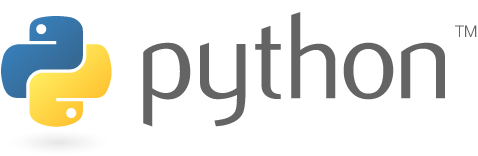</td>
<td align="center" bgcolor="#ffffff" width="110" height="110">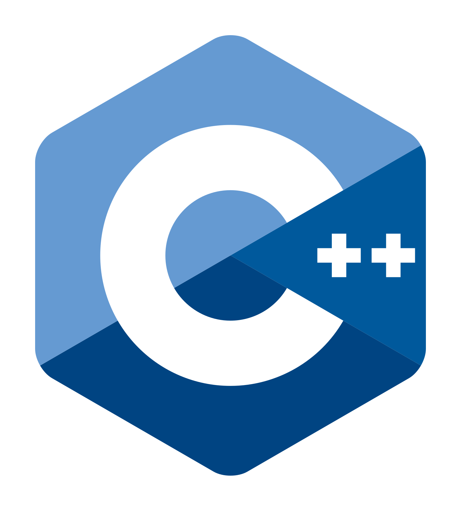</td>
</tr>
<tr>
<td align="center" bgcolor="#ffffff" width="110" height="110"></td>
<td align="center" bgcolor="#ffffff" width="110" height="110">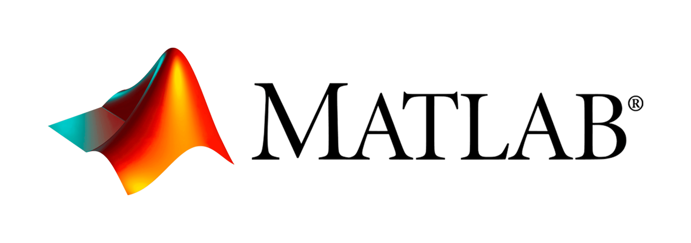</td>
</tr>
</table>

</td>
<td valign="top" width="25%">

### Frameworks

<table cellspacing="6" cellpadding="8">
<tr>
<td align="center" bgcolor="#ffffff" width="110" height="110">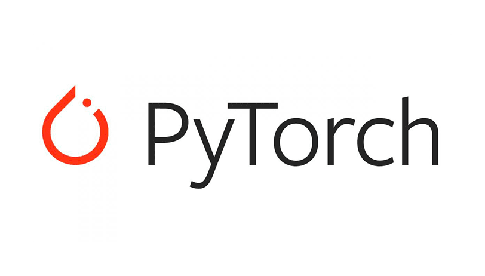</td>
<td align="center" bgcolor="#ffffff" width="110" height="110">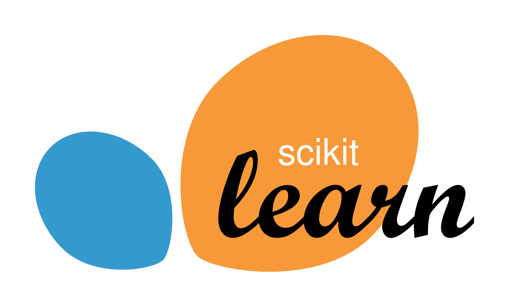</td>
</tr>
<tr>
<td align="center" bgcolor="#ffffff" width="110" height="110"></td>
<td align="center" bgcolor="#ffffff" width="110" height="110"></td>
</tr>
<tr>
<td align="center" bgcolor="#ffffff" width="110" height="110">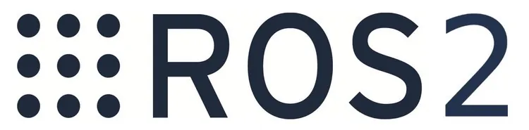</td>
<td align="center" bgcolor="#ffffff" width="110" height="110"></td>
</tr>
<tr>
<td align="center" bgcolor="#ffffff" colspan="2" width="226" height="80">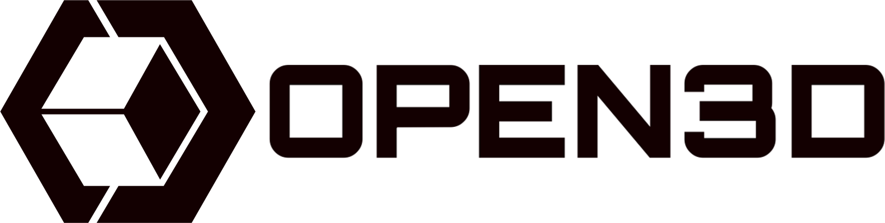</td>
</tr>
<tr>
<td align="center" bgcolor="#ffffff" colspan="2" width="226" height="80"></td>
</tr>
</table>

</td>
<td valign="top" width="25%">

### Tools

<table cellspacing="6" cellpadding="8">
<tr>
<td align="center" bgcolor="#ffffff" width="110" height="110">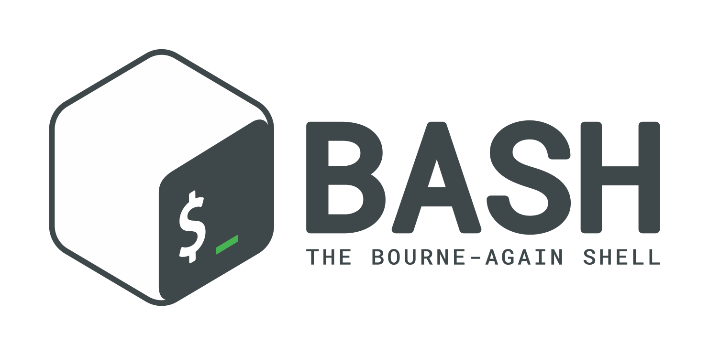</td>
<td align="center" bgcolor="#ffffff" width="110" height="110"></td>
</tr>
<tr>
<td align="center" bgcolor="#ffffff" width="110" height="110">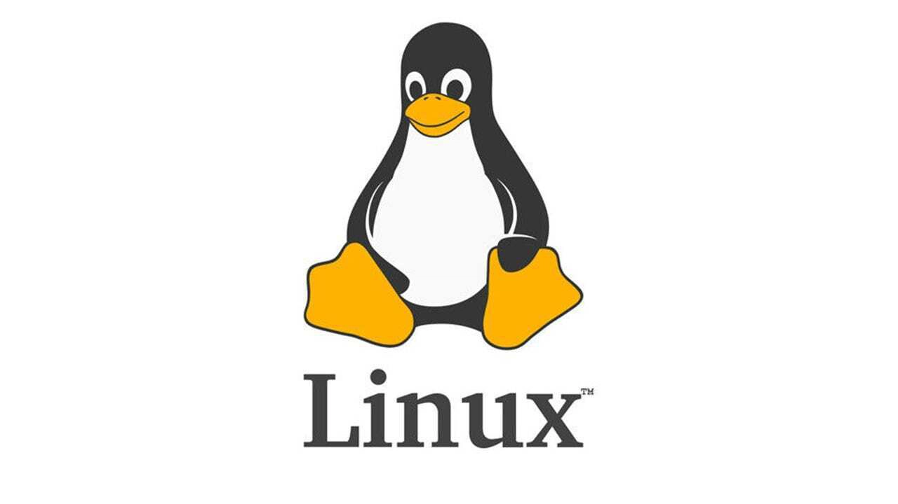</td>
<td align="center" bgcolor="#ffffff" width="110" height="110">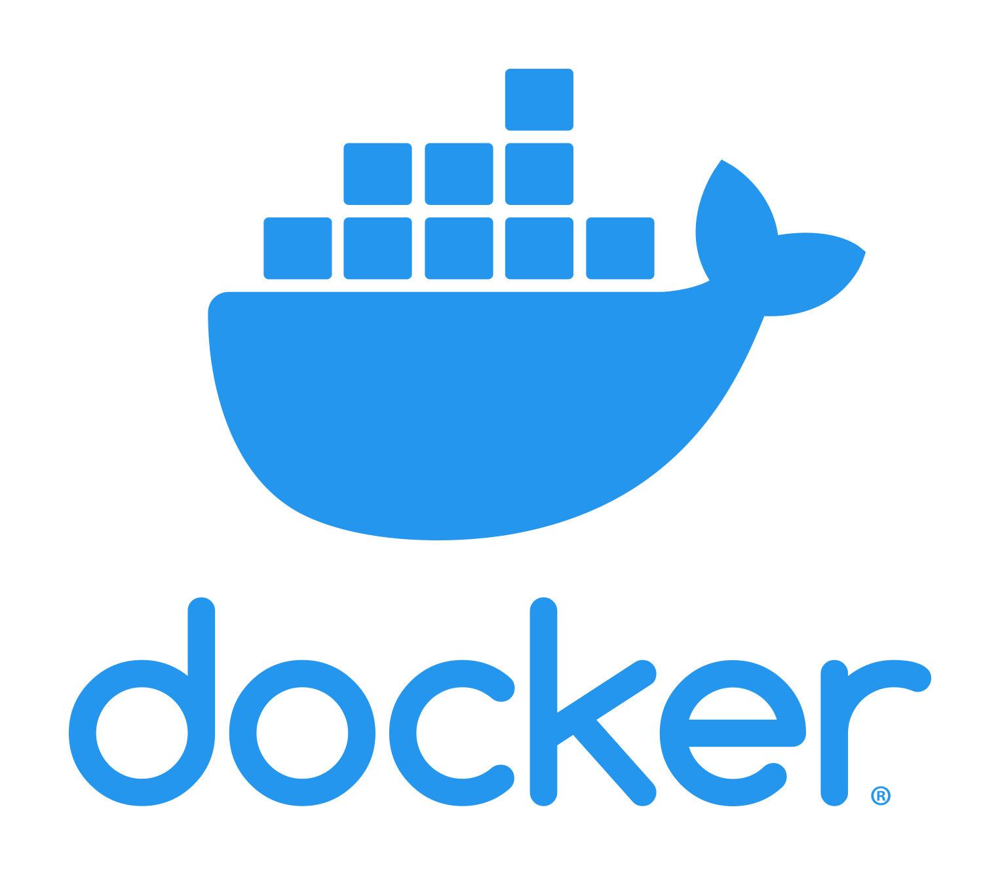</td>
</tr>
<tr>
<td align="center" bgcolor="#ffffff" width="110" height="110">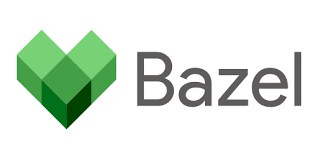</td>
<td align="center" bgcolor="#ffffff" width="110" height="110"></td>
</tr>
</table>

</td>
<td valign="top" width="25%">

### Simulators

<table cellspacing="6" cellpadding="8">
<tr>
<td align="center" bgcolor="#ffffff" width="110" height="110">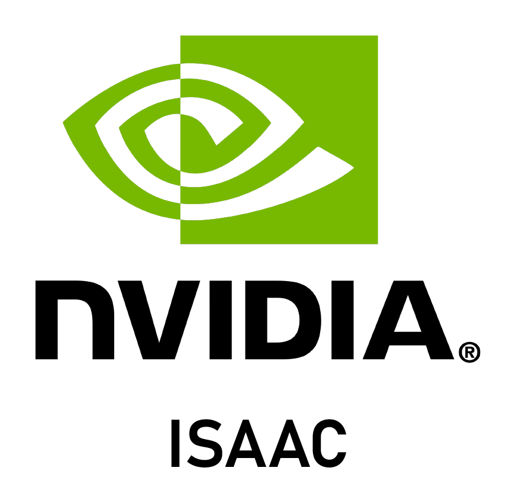</td>
<td align="center" bgcolor="#ffffff" width="110" height="110"></td>
</tr>
</table>

</td>
</tr>
</table>

---

## GitHub Stats

---

## Selected Publications

- **Multi-layer Motion Planning with Kinodynamic and Spatio-Temporal Constraints** — ACM HSCC 2025
- **Autonomous Exploration using Ground Robots with Safety Guarantees** — IEEE/RSJ IROS 2023
- **Scalable Controller for Multi-Agent Systems Using Barrier Functions and Symbolic Control** — IEEE CDC 2023
- **Funnel-based Reachability Control of Unknown Nonlinear System using Gaussian Process** — IEEE ICC 2022
